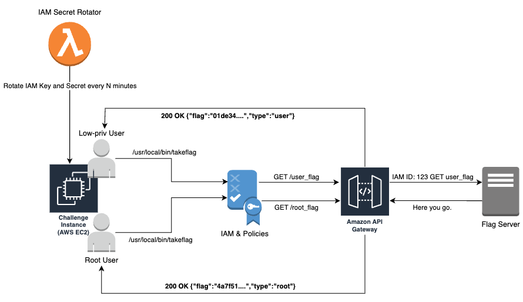
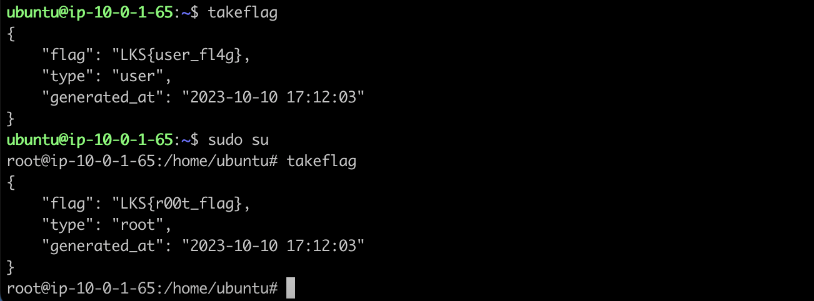

# Gateflag for CTF A&D
**Gateflag** (practically read as *getflag*) is an IaC-enabled project that allows easy deployment of Attack & Defense CTF instances with **user/root flag** obtained from IAM-controlled API endpoints. This allows for a subtle tick implementation: easily rotates user/root flag between ticks. 



## Cloud Environments
Currently built for AWS environment with CloudFormation stack. The so-called stack consists of:
- AWS API Gateway (REST)
- AWS EC2
- AWS IAM & Managed Policies
- VPC, Subnet & Routing, and other networking configurations.

## How It Works
Instead of directly updating the value of the user/root flag inside the CTF instance on every tick, **Gateflag** sets up two specific API endpoints (with AWS API Gateway) that the players can call to get their user/root flag. These endpoints are protected with IAM and ACL policies, so the endpoint that emits **root flag** can only be called by the **root user**, and the endpoint that emits **user flag** can only be called by the **normal user**.



### POV: CTF Administrator
After deploying the cloud infrastructure, the CTF Administrator should configure their **Flag Server** to handle incoming requests relayed by the AWS API Gateway and issue the correct flag for the user. 

The server will receive a request with information such as the IP address of the machine and the IAM User’s ARN of the invoker.
```
POST /user_flag HTTP/1.1
Host: flaggy.free.beeceptor.com
User-Agent: AmazonAPIGateway_mxkb7e6wih
content-length: 0
Accept: application/json
X-Amzn-Apigateway-Api-Id: mxkb7e6wih
x-Amzn-Trace-Id: Root=1-653555f7-27c812bc79b53d99d0c16925
X-Forwarded-For: 18.138.134.203
X-Forwarded-Proto: https
X-User-Arn: 725126486995
X-Source-Ip: 10.0.1.101
Accept-Encoding: gzip
```

### POV: CTF Participants
As a participant, after *pwning* your way into the machine, you just have to execute `/usr/local/bin/takeflag` binary. You'll get the flag depending on what user you're currently on: if you're **root**, you'll get the **root flag**, and vice versa.

## How to Deploy
There are two ways to check this project out: **simple deployment** and **provisioned deployment**.

#### Simple Deployment
Follow this section to simply test the project and see what cloud resources it creates. The overall configuration is located at `dist/template.yaml`. 

Please note that this configuration will only create one (1) EC2 instance that acts as the CTF player's machine. If you need to create more machines (for more players), please refer to the **Provisioned Deployment** section.

First, clone the repository:
```
git clone https://github.com/chrisandoryan/Gateflag.git
cd Gateflag/
```
Deploy using AWS CLI:
```
aws cloudformation deploy --template-file ./dist/template.yaml --stack-name gateflag-stack
```
Before you can use AWS CLI to deploy this project using CloudFormation, you need to install CLI on your machine and configure it using your credentials (access key/secret key). See [here](https://docs.aws.amazon.com/cli/latest/userguide/getting-started-install.html).

#### Provisioned Deployment
TBA.

## Future Improvements
